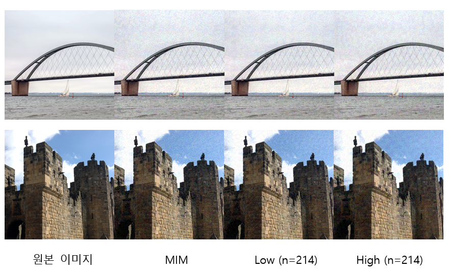

# 주파수 영역의 적대적 공격에 따른 공격 성공률과 이미지 품질 비교 (IPIU 2021)

  

## 요약
최근 심층 신경망의 발전에 따라 다양한 이미지 분류 모델이 소개되어 왔지만, 이러한 모델도 여전히 적대적 공격에 취약성을 보이고 있다. 일반적으로 적대적 공격의 교란 신호를 저주파 영역에 가했을 때 공격 성공률이 더 크게 나타나는 것으로 알려져 있지만 눈으로 판단하는 이미지의 왜곡 정도와 공격 성공률 비교에는 한계가 있기 때문에 좀 더 객관적인 지표가 필요하다. 본 연구에서는 적대적 공격 교란 신호에 서로 다른 주파수 영역의 제한을 두었을 때 인지적 관점에서의 적대적 공격 성공률을 비교 분석하고, 이미지 품질이 공격 성공률과 늘 비례하지 않음을 보인다. 또한 저주파 영역 공격의 실질적인 유효성을 보여 향후 최적화된 공격을 만들 수 있는 여지를 보인다.

## 데이터셋
NIPS 2017: Adversarial Learning Development Set [다운로드](https://www.kaggle.com/datasets/google-brain/nips-2017-adversarial-learning-development-set)
